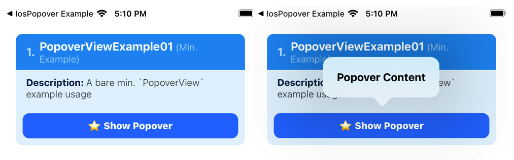
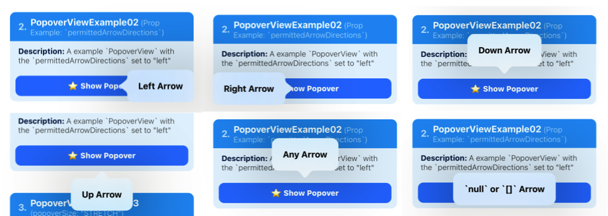
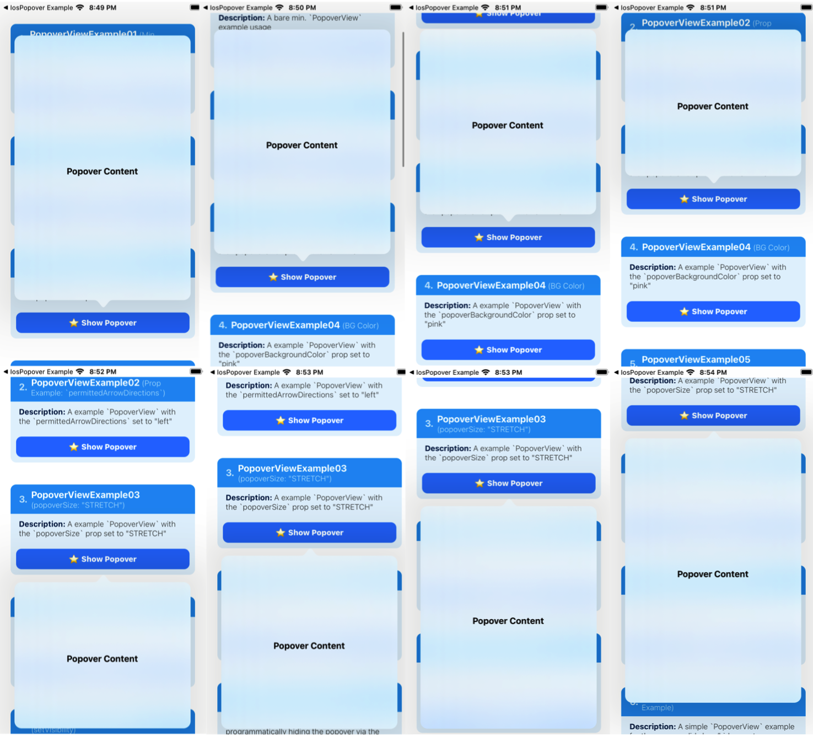
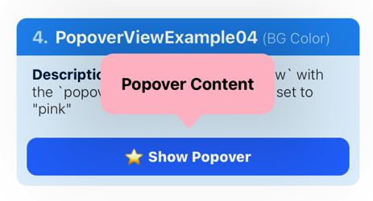
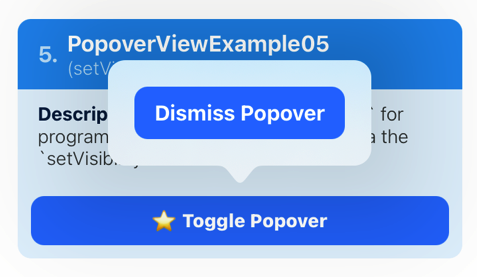
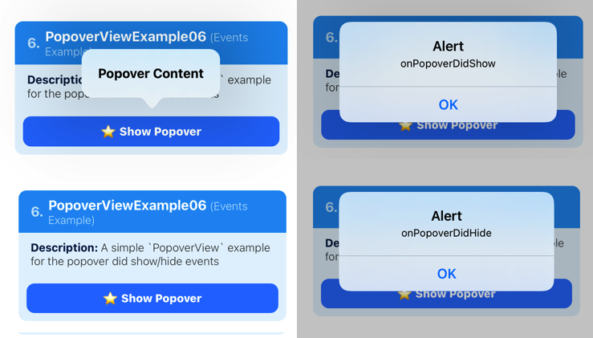
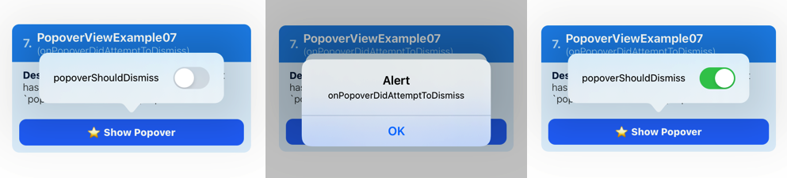
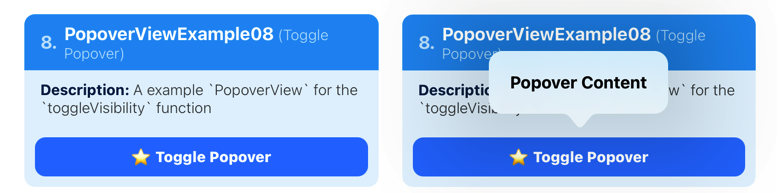

# react-native-ios-popover

A react native wrapper component to use the native iOS popover by wrapping a react native view inside a `UIViewController` and presenting it.

`PopoverView` **Left**: [Example 1](#popoverview-example-01), [Example 2](#popoverview-example-02), and **Right**: [Example 3](#popoverview-example-03), [Example 4](#popoverview-example-04)


`PopoverView` **Left**: [Example 5](#popoverview-example-05), [Example 6](#popoverview-example-06), and **Right**: [Example 7](#popoverview-example-07), [Example 8](#popoverview-example-08)


<br><br>

------

### 🚧⚠️ Documentation WIP 🚧⚠️
Re-write in progress (see [TODO](https://github.com/dominicstop/react-native-ios-popover/blob/master/docs/TODO.md) for updates). See [`README-old.md`](./README-old.md) for the old version of the documentation.

<br>

## 1. Installation

```sh
# 1 install via npm...
npm install react-native-ios-popover

# 1.2 ...or install via yarn 
yarn add react-native-ios-popover

# 2.1 install dependency via npm...
npm install react-native-ios-utilities

# 2.2 ...or install dependency via yarn
# Note: See "Installation: Dependencies" section for more details
yarn install react-native-ios-utilities

# 3. then run pod install (uses auto-linking)
cd ios && pod install
```

<br><br>

### 1.1 Installation Notes
If you encounter any errors/bugs while using this library, or want a particular feature implemented, please see the [troubleshooting section](#12-troubleshooting), or create an issue!

<br>

### Installation: Dependencies

This library depends on [`react-native-ios-utilities`](PLACEHOLDER) for some of the native functionality (i.e. it uses it as a peer dependency).

If you want to install and use a specific version of this library, please see the [Installation: Versions and Compatibility](#installation-versions-and-compatibility) section for more details.  

If you are using any other library that uses `react-native-ios-utilities` (e.g. `react-native-ios-context-menu`, etc)., then please refer to the [version compatibility guide](PLACEHOLDER).

<br><br>

### Installation: Versions and Compatibility

The library's peer dependency requirements are enforced using [semver](http://semver.org/) (i.e. `major.minor.patch`). If you wish to use a specific version of this library, then please install the corresponding version of `react-native-ios-utilities`.<br><br>📝 **Note**: As a general rule, the `major` version should be the same between the **library** and the **dependency**. For example, if you're using `react-native-ios-popover@2.3.12`, then you should install `react-native-ios-popover@2.x.x`, etc.

| Library Version <br>`react-native-ios-popover` | Dependency Version <br>`react-native-ios-utilities` |
| ---------------------------------------------- | --------------------------------------------------- |
| `0.x.x`                                        | `N/A` (No External Dependencies)                    |
| `1.x.x`                                        | `0.x.x`                                             |
| `2.0.x`                                        | `2.0.x`                                             |
| `3.0.x`                                        | `3.0.x`                                             |

<br><br>

### 1.2 Troubleshooting

#### Troubleshooting: Xcode Build Error (Swift)
This library is written in Swift. If you are having trouble building your app after installing this library, try adding an empty swift file:
1. Open up your `ios/project.xcworkspace` project
2. On the project navigator panel (located on the right side of Xcode), right click on your project group (or another folder/group i.e the blue or yellow icons) and select the "*New File...*" option
3. In the popup sheet, select "Swift" as the template and then click the "*Next*" button
4. A "*Save As*" popup sheet should appear and then click "*Create*" (you can rename the file first if you want to)
5. If Xcode asks you to create a "*Objective-C Bridging Header*" choose *"Create Objective-C Bridging Header"*

<br><br>

#### Troubleshooting: Cocoapods Static Libraries Error
If you encounter the following error when running `pod install`:

```
[!] The following Swift pods cannot yet be integrated as static libraries:

The Swift pod `react-native-ios-popover` depends upon `React-Core`, which does not define modules. To opt into those targets generating module maps (which is necessary to import them from Swift when building as static libraries), you may set `use_modular_headers!` globally in your Podfile, or specify `:modular_headers => true` for particular dependencies.
```

<br>

Then try following these steps:
1. Open up your project's `ios/podfile` configuration
2. Under `target 'ProjectName' do` block, find the `'React-Core'` pod, and append the following snippet to the end of the line: `, :modular_headers => true`
3. It should now look something similar to this: `pod 'React-Core', :path => '../node_modules/react-native/', :modular_headers => true`
4. Try running `pod install` again.

<br><br>

## 2. Usage

Please check out the [examples section](#41-popoverview-examples) or the [examples directory](https://github.com/dominicstop/react-native-ios-popover/tree/master/example/src) for more on how to use it.

```jsx
import { PopoverView } from "react-native-ios-popover";

function PopoverViewExample() {
  const popoverRef = useRef();

  return (
    <PopoverView
      ref={popoverRef}
      renderPopoverContent={() => (
        <View style={{padding: 20}}>
          <Text>
            {'Popover Content'}
          </Text>
        </View>
      )}
    >
      <TouchableOpacity onPress={() => {
        popoverRef.current.toggleVisibility();
      }}>
        <Text>
          {'Toggle Popover Visibility'}
        </Text>
      </TouchableOpacity>
    </PopoverView>
  );
};
```

<br>

## 3. Documentation
### 3.1 Modules/Components
#### `PopoverView` Component

##### `PopoverView` Component: Props

| Prop Name                         | Description                                                  |
| --------------------------------- | ------------------------------------------------------------ |
| 🔤 **Required:** <br> `renderPopoverContent`<br/><br/>⚛️ `() => React.ReactElement` | The elements to show in the popover. This prop accepts a function that returns an element. The element returned from this function will be shown in the popover.<br><br>See [example 1](#411-popoverview-example-1) section. |
| 🔤  `popoverSize`<br/><br/>⚛️ `PopoverSizeConfig`<br/><br/>✳️ **Default**: `{ type: 'INHERIT' }` | Controls the size the of the popover.<br><br>This prop accepts a `PopoverSizeConfig` object.<br><br>If you want to set a custom size for the popover, provide a `PopoverSizeConfig` with the type property set to `CUSTOM`, along with the desired height and width (e.g. `{type: 'CUSTOM', width: 100, height: 100}`).<br><br>See [example 3](#413-popoverview-example-3) section. |
| 🔤  `popoverBackgroundColor`<br/><br/>⚛️ `string`<br/><br/>✳️ **Default**: `transparent` | Sets the background color of the popover.<br><br>See [example 4](#414-popoverview-example-4) section. |
| 🔤  `permittedArrowDirections`<br/><br/>⚛️ `Array<PopoverArrowDirections>` | Sets the arrow directions that you allow for the popover. <br><br>Accept an array of 0 or more string values, i.e. an array of `ArrowDirections` enum items (e.g. `up`, `down`, etc.)<br/><br/>Note If you pass in an empty array, then there will be no arrow shown.<br><br>See [example 2](#412-popoverview-example-2) section. |
| 🔤  `lazyPopover`<br/><br/>⚛️ `boolean`<br/><br/>✳️ **Default**: `true` | Controls whether or not the popover content is always mounted. If set to `true` the popover content will only be mounted while the popover is visible.<br/><br/>Set this to `false` to prevent the popover from closing. |
| 🔤  `popoverShouldDismiss`<br/><br/>⚛️ `boolean`<br><br>✳️ **Default**: `true` | Controls whether or not a tap outside the popover will dismiss it.<br><br>See [example 7](#417-popoverview-example-7) section. |
| 🔤  `popoverCan`<br>`OverlapSourceViewRect`<br/><br/>⚛️ `boolean`<br/><br/>✳️ **Default**: `false` | Controls whether the popover can overlap its source view. If set to `false` the popover will avoid covering up the source view.<br/><br/>See [example 3](#413-popoverview-example-3) section. |

<br>

##### `PopoverView` Component: Events

| Event Name                                                   | Description                                                  |
| ------------------------------------------------------------ | ------------------------------------------------------------ |
| 🔤  `onPopoverDidShow`<br/><br/>⚛️ `OnPopoverDidShowEvent`     | Event that gets called **after** the popover is shown, i.e. this event is invoked after the popover entrance animation is finished. |
| 🔤  `onPopoverDidHide`<br/><br/>⚛️ `OnPopoverDidHideEvent`     | Event that gets called **after** the popover is hidden, i.e. this event is invoked after the popover exit animation is finished. |
| 🔤  `onPopoverWillShow`<br/><br/>⚛️ `OnPopoverWillShowEvent`   | Event that gets called **before** the popover is shown, i.e. this event is immediently invoked when the popover is about to become visible. |
| 🔤  `onPopoverWillHide`<br/><br/>⚛️ `OnPopoverWillHideEvent`   | Event that gets called **before** the popover is hidden, i.e. this event is immediently invoked when the popover is about to become hidden. |
| 🔤  `onPopoverDidHideViaTap`<br/><br/>⚛️ `OnPopoverDidHideViaTapEvent` | Event that gets called **before** the popover is hidden due to a tap outside the popover's content, i.e. this event is immediently invoked when the popover is about to become hidden. |
| 🔤  `onPopoverWillHideViaTap`<br/><br/>⚛️ `OnPopoverWillHideViaTapEvent` | Event that gets called **after** the popover is hidden due to a tap outside the popover's content, i.e. this event is invoked after the popover exit animation is finished. |
| 🔤  `onPopoverDidAttemptToDismiss`<br/><br/>⚛️ `OnPopoverDidAttemptToDismissEvent` | This event is invoked when the `popoverShouldDismiss` prop is set to `false`, and a tap outside the popover's content is initiated to dismiss the popover. |

<br>

##### `PopoverView` Component: Functions

| Function Name            | Description                                                  |
| ------------------------------------- | ------------------------------------- |
| 🔤  `setVisibility(`<br>`visibility: boolean)`<br/><br/>⚛️ `Promise<void>` | A function that you can call to set whether or not the popover is shown or hidden.<br>This function returns a promise that gets resolved when the popover is successfully shown or hidden. This function throws an error if the popover is already hidden or shown.<br/><br/>See [Example 1](#411-popoverview-example-1) section |
| 🔤  `toggleVisibility`<br><br/>⚛️ `Promise<void>` | A function that you can call to toggle the popover's visibility.<br/>This function returns a promise that gets resolved when the popover is successfully shown or hidden.<br><br> |
| 🔤  `getVisibility`<br/><br/>⚛️ `Promise<boolean>` | A function to query whether or not the popover is visible. Returrns a promise that resolves to a boolean value. |

### 3.2 Objects and Types

#### 📄 `PopoverRelatedTypes.ts`

* 📌 **Declaration**: [`PopoverRelatedTypes.ts`](src/types/PopoverRelatedTypes.ts)

##### String Union: `PopoverSize`

This type is used in the `PopoverView` component's `popoverSize` prop. Use this type to control the size of the popover.

| Value     | Description                                                  |
| --------- | ------------------------------------------------------------ |
| `INHERIT` | The default value. Specifies that the popover's size should match the view you return from `PopoverView.renderPopoverContent` prop. It will automatically resize/scale the popover to fit the screen. |
| `STRETCH` | Specifies that we want the popover to be as big as possible, i.e. the popover should to stretch and fill up the screen. |
| `CUSTOM`  | Specifies that a custom size is to be use for popover via the `popoverSize` object. |

<br>

##### String Union:  `ArrowDirections`

This type is used to for the `PopoverView` component's `permittedArrowDirections` prop. This type corresponds to the `UIPopoverArrowDirection` swift struct, check out the [apple docs](https://developer.apple.com/documentation/uikit/uipopoverarrowdirection) for more info.

| Value     | Description                                                  |
| --------- | ------------------------------------------------------------ |
| `up`      | An arrow that points upward. The popover will appear at the bottom with the arrow pointing up. |
| `down`    | An arrow that points downward. The popover will appear at the top with the arrow pointing down. |
| `left`    | An arrow that points toward the left. The popover will appear at the right with the arrow pointing left. |
| `right`   | An arrow that points toward the right. The popover will appear at the left with the arrow pointing right. |
| `any`     | An arrow that points in any direction.                       |
| `unknown` | The status of the arrow is currently unknown.                |

<br><br>

## 4 Examples

Check out the [examples directory](https://github.com/dominicstop/react-native-ios-popover/tree/master/example). The example app contains a bunch of demos that showcases the different `PopoverView` configurations, props and events you can use. The [assets directory](https://github.com/dominicstop/react-native-ios-popover/tree/master/assets) contains gifs and screenshots for every example/test shown in the example app.
* Note: the section title on each example contains a link to the corresponding example code.
1. Clone the repository: `git clone https://github.com/dominicstop/react-native-ios-popover.git`
2. `cd react-native-ios-popover && yarn bootstrap`
3. Go to the `react-native-ios-context-popover/example` directory and run `yarn ios` to build/launch the example app in the iOS simulator.
### 4.1 `PopoverView` Examples
#### `PopoverView` Example 01

A bare minimum example showing how to present a popover via the `setVisibility` function.

<br>

[🔗 Full Example](example/src/components/PopoverViewExample01.tsx)

```jsx
function PopoverViewExample01() {
  const popoverRef = useRef();

  return (
    <PopoverView
      // get/store a ref to the popover component
      ref={popoverRef}
      // a function that returns the content to show
      // inside the popover
      renderPopoverContent={() => (
        <View style={{padding: 20}}>
          <Text>
            {'Popover Content'}
          </Text>
        </View>
      )}
    >
      <TouchableOpacity onPress={() => {
        // show the popover when the button is pressed
        // (note: `setVisibility` will throw an error if attempting to 
        // show a popover that's already visible)
        // alt. you can call `toggleVisibility` to show/hide the popover
        popoverRef.current.setVisibility(true);
      }}>
        <Text>
          {'Show Popover'}
        </Text>
      </TouchableOpacity>
    </PopoverView>
  );
};
```



<br><br>

####  `PopoverView` Example 02

A example `PopoverView` for the `permittedArrowDirections` prop. 

* This prop accepts an array of `ArrowDirections` string values (e.g: 'up', 'down', etc). You can also pass in an empty array or null to specify that the popover should not have an arrow.
* The popover position and sizing will automatically adapt based on the `permittedArrowDirections`.

<br>

[🔗 Full Example](example/src/components/PopoverViewExample02.tsx)

```jsx
function PopoverViewExample02() {
  const popoverRef = useRef();
  
  return(
    <PopoverView
      ref={popoverRef}
      // the allowed direction of the popover arrow.
      // accepts an array of `ArrowDirections` values,
      // e.g. "up", "down", etc.
      permittedArrowDirections={["left"]}
      renderPopoverContent={() => (
        <View style={{padding: 20}}>
          <Text>
            {'Left Arrow'}
          </Text>
        </View>
      )}
      >
      <TouchableOpacity onPress={() => {
        popoverRef.current.setVisibility(true);
      }}>
        <Text>
          {'Show Popover'}
        </Text>
      </TouchableOpacity>
    </PopoverView>
  );
};
```



<br><br>

####  `PopoverView` Example 03

A example `PopoverView` with the `popoverSize` prop set to `STRETCH`. 

* By default, the `popoverSize` prop is set to `INHERIT` which means the size of the popover is determined by the size of the popover content.
* However, if you set the prop  to `STRETCH`, the popover will be sized to be as big as possible based on the `permittedArrowDirections` prop, its position on screen, etc. 

<br>

[🔗 Full Example](example/src/components/PopoverViewExample03.tsx)

```jsx
function PopoverViewExample03() {
  const popoverRef = useRef();

  return(
    <PopoverView
      ref={popoverRef}
      // set the `popoverSize` prop to `STRETCH` to make the
      // popover as big as possible.
      popoverSize={{type: 'STRETCH'}}
      // You also have to set `popoverCanOverlapSourceViewRect`
      // prop to false to prevent the popover from covering up
      // the popover source view.
      popoverCanOverlapSourceViewRect={false}
      permittedArrowDirections={["up", "down"]}
      // the style of the root popover content view must be set
      // to `{flex: 1}` so that it'll stretch to the size of the
      // popover.
      renderPopoverContent={() => (
        <View style={{flex: 1, alignItems: 'center', justifyContent: 'center'}}>
          <Text>
            {'Popover Content'}
          </Text>
        </View>
      )}
    >
      <TouchableOpacity onPress={() => {
        popoverRef.current.setVisibility(true);
      }}>
        <Text>
          {'Show Popover'}
        </Text>
      </TouchableOpacity>
    </PopoverView>
  );
};
```



<br><br>

####  `PopoverView` Example 04

A example `PopoverView` with the `popoverBackgroundColor` prop set to "pink". By default, the `PopoverView` has a transparent background with a blur effect.

<br>

[🔗 Full Example](example/src/components/PopoverViewExample04.tsx)

```jsx
function PopoverViewExample04(props) {
  const popoverRef = useRef();

  return (
    <PopoverView
      ref={popoverRef}
      // pass in a valid color value
      popoverBackgroundColor={'pink'}
      renderPopoverContent={() => (
        <View style={{padding: 20}}>
          <Text>
            {'Popover Content'}
          </Text>
        </View>
      )}
    >
      <TouchableOpacity onPress={() => {
        popoverRef.current.setVisibility(true);
      }}>
        <Text>
          {'Show Popover'}
        </Text>
      </TouchableOpacity>
    </PopoverView>
  );
};
```



<br><br>

#### `PopoverView` Example 05

A example `PopoverView` for programmatically hiding the popover via the `setVisibility` function.

* The `setVisibility(bool)` function will throw an error if it's already visible or hidden.

<br>

[🔗 Full Example](example/src/components/PopoverViewExample05.tsx)

```jsx
function PopoverViewExample05(props) {
  const popoverRef = useRef();

  return (
    <PopoverView
      ref={popoverRef}
      onPopoverDidHideViaTap={() => alert('onPopoverDidHideViaTap')}
      renderPopoverContent={() => (
        <View style={{padding: 20}}>
          <TouchableOpacity onPress={() => {
            // hide the popover
            popoverRef.current.setVisibility(false);
          }}>
            <Text>
              {'Dismiss Popover'}
            </Text>
          </TouchableOpacity>
        </View>
      )}
    >
      <TouchableOpacity onPress={() => {
        // toggle popover visibility
        popoverRef.current.toggleVisibility();
      }}>
        <Text>
          {'Toggle Popover'}
        </Text>
      </TouchableOpacity>
    </PopoverView>
  );
};
```



<br><br>

####  `PopoverView` Example 06

A simple `PopoverView` example for the popover did show/hide events.

<br>

[🔗 Full Example](example/src/components/PopoverViewExample06.tsx)

```jsx
function PopoverViewExample06(props) {
  const popoverRef = useRef();

  return(
    <PopoverView
      ref={popoverRef}
      // popover events
      onPopoverDidHide={() => alert('onPopoverDidHide')}
      onPopoverDidShow={() => alert('onPopoverDidShow')}
      renderPopoverContent={() => (
        <View style={{padding: 20}}>
          <Text style={styles.popoverText}>
            {'Popover Content'}
          </Text>
        </View>
      )}
    >
      <TouchableOpacity onPress={() => {
        popoverRef.current.setVisibility();
      }}>
        <Text>
          {'Toggle Popover'}
        </Text>
      </TouchableOpacity>
    </PopoverView>
  );
};
```



<br><br>

#### 4.1.7 `PopoverView` Example 07

A example `PopoverView` that has a switch that toggles the `popoverShouldDismiss` prop.

* The `onPopoverDidAttemptToDismiss` prop is set to `true` by default. This prop controls whether or not the popover should dismiss when there's a tap gesture outside the popover.
* So setting the `onPopoverDidAttemptToDismiss` to `false` will prevent the popover from dismissing via a tap outside the popover.

<br>

[🔗 Full Example](example/src/components/PopoverViewExample07.tsx)

```jsx
function PopoverViewExample07(props) {
  const popoverRef = useRef();
  
  const [isEnabled, setIsEnabled] = useState(false);
  // toggle `popoverShouldDismiss`
  const toggleSwitch = () => setIsEnabled(previousState => !previousState);

  return(
    <PopoverView
      ref={popoverRef}
      // set the `popoverShouldDismiss` prop
      popoverShouldDismiss={isEnabled}
      onPopoverDidAttemptToDismiss={() => alert('onPopoverDidAttemptToDismiss')}
      renderPopoverContent={() => (
        <View>
          <Text>
            {'popoverShouldDismiss'}
          </Text>
          <Switch
            onValueChange={toggleSwitch}
            value={isEnabled}
          />
        </View>
      )}
    >
      <TouchableOpacity onPress={() => {
        popoverRef.current.setVisibility(true);
      }}>
        <Text>
          {'Show Popover'}
        </Text>
      </TouchableOpacity>
    </PopoverView>
  );
};
```



<br><br>

#### `PopoverView` Example 08

A example `PopoverView` for the `toggleVisibility` function.

<br>

[🔗 Full Example](example/src/components/PopoverViewExample08.tsx)

```jsx
function PopoverViewExample08(props) {
  const popoverRef = useRef();

  return(
    <PopoverView
      ref={popoverRef}
      popoverShouldDismiss={false}
      renderPopoverContent={() => (
        <View style={{padding: 20}}>
          <Text>
            {'Popover Content'}
          </Text>
        </View>
      )}
    >
      <TouchableOpacity onPress={() => {
        // toggle the popover visibility
        popoverRef.current.toggleVisibility();
      }}>
        <Text>
          {'Toggle Popover'}
        </Text>
      </TouchableOpacity>
    </PopoverView>
  );
};
```



<br><br>

## License
MIT

<br>

## Links
* I'm [@DominicGo](https://twitter.com/GoDominic) on twitter if you have any questions ✨
* Other libraries: [react-native-ios-modal](https://github.com/dominicstop/react-native-ios-modal), [react-native-ios-context-menu](https://github.com/dominicstop/react-native-ios-context-menu)
* This library was generated/made using [@react-native-community/bob](https://github.com/callstack/react-native-builder-bob)